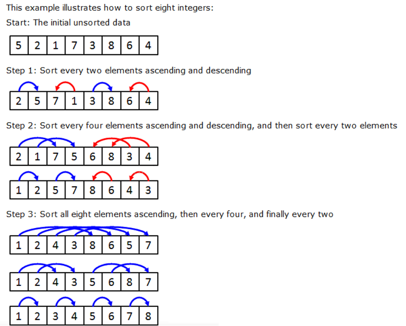

# 一、算法使用：

1、文件说明：

主体类：Bitonic.Java; BitonicSortRunnable.Java; BitonicMergeRunnable.Java

测试类：ThreadBitonicTest.Java

  
2、程序调用： 实例化Bitonic类调用其sort方法（见ThreadBitonicTest.Java）

Bitonic b = new Bitonic();

b.sort(array, Bitonic.ASCENDING);//排序

输入：待排序整型数组，排序方式（升序/降序) (true-升序；false-降序)

输出：无，结果表现为输入array为排序结果

  
3、算法表现影响参数：

numberOfProcessors-程序模拟处理器数目，影响排序新建的线程数，使得排序效率有所不同

在Bitonic.Java类中，private final int numberOfProcessors = 8; 语句处设置，默认为8

  
  

# 二、排序算法步骤：

1、padding：补全输入数组长度为2的整数次幂（若数组长度满足则跳过），使用Integer.MAX_VALUE进行补充；

2、sort：使用padding结果数组进行排序；a、将普通序列转换为双调序列；b、双调排序；

详细见示例：

3、copy：排序结果到输入数组中，由于补充值为Integer.MAX_VALUE（始终排最后），在排序后的补全数组中copy输入数组长度的数组即可得到其排序结果。

  
  

# 三、相关参考资料：

https://blog.csdn.net/billbliss/article/details/78955466

https://github.com/novazerone/ThreadedBitonic

https://cs.paperswithcode.com/paper/comparison-of-parallel-sorting-algorithms

